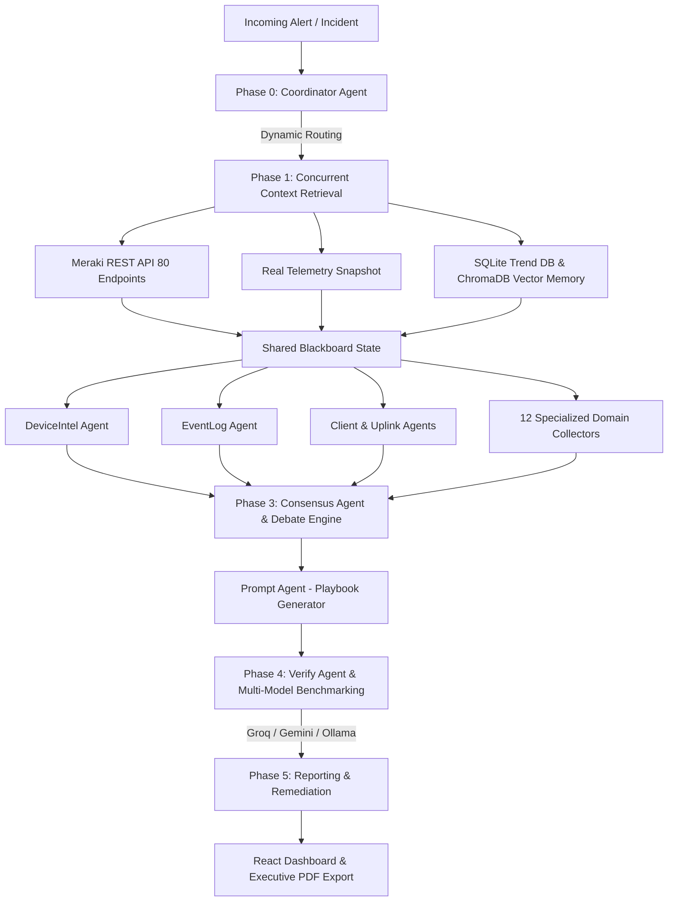

# 📡 MerakiMind — AI Network Intelligence & Autonomous Operations (AIOps Platform)

[](https://github.com/luonglt20/AIops_Cisco)
[](https://www.python.org/)
[](https://reactjs.org/)
[](https://developer.cisco.com/meraki/)
[](https://www.docker.com/)

**MerakiMind** là nền tảng **AIOps & Network Intelligence Platform** thế hệ mới dành cho hạ tầng mạng **Cisco Meraki**. Hệ thống kết hợp kiến trúc **Multi-Agent Shared Blackboard**, vòng lặp suy luận **ReAct Loop**, bộ nhớ vector **ChromaDB**, và đối soát đa mô hình **Multi-LLM Benchmarking (Groq, Gemini, Ollama)** giúp chẩn đoán tự động sự cố mạng, dựng chuỗi nguyên nhân - hậu quả (Causal Chain) và tự động khắc phục lỗi (Autonomous Self-Healing).

---

## 🌟 TÍNH NĂNG NỔI BẬT (KEY FEATURES)

- **📡 80 Cisco Meraki Dashboard REST APIs Coverage**: Tích hợp toàn bộ 80 REST APIs từ giám sát phần cứng, telemetry vô tuyến RF, switch ports, MT sensors, Cisco Umbrella SIG, đến SD-WAN Traffic Shaping.
- **🤖 12 Multi-Agent AI Engine**: Kiến trúc Blackboard phân vai 12 Agent chuyên biệt (DeviceIntel, EventLog, ClientImpact, UplinkWAN, AuditConfig, AppQoE, RFWireless, SwitchPort, WanSdwan, SensorIoT, SecurityAirMarshal, FirmwareCrash) điều hành bởi `CoordinatorAgent`.
- **⚡ ReAct Autonomous Live Tools**: Tự động kích hoạt công cụ đo kiểm trực tiếp trên phần cứng qua API (Live Ping, Cable Test TDR, Speedtest Throughput, ARP Table, Traceroute, PCAP Capture, MTR).
- **🔄 Dual/Triple-Model Benchmarking**: Chạy đối soát chất lượng prompt & đo đếm độ trễ song song giữa **Groq (Llama 3.3 70B)**, **Google Gemini 1.5** và **Ollama Local AI**.
- **🧠 Zero-Hallucination & Quality Control**: Kiểm soát ảo giác với `VerifyAgent` sử dụng Pydantic Schema `VerificationResult` và Ground Truth Telemetry Binding.
- **💾 Long-Term Memory & Trend Analysis**: Lưu trữ tiền lệ sự cố trong **ChromaDB Semantic Vector Memory** và phân tích độ lặp sự cố 24h qua **SQLite Trend DB**.
- **🛠️ Self-Healing & Remediation Engine**: Can thiệp khởi động lại thiết bị từ xa, reset nguồn PoE cổng Switch, nháy đèn LED định vị, cách ly Client nhiễm malware, và Clear CRC counters.
- **📄 Executive PDF Report Engine**: Xuất báo cáo sự cố chuẩn kỹ thuật & nhân sự tiếng Việt Unicode qua ReportLab.
- **🐳 Multi-Platform & Docker Containerized**: Hỗ trợ chạy trên macOS, Windows (`START.bat`, `START.ps1`), Linux và Docker Compose.

---

## 🏛️ KIẾN TRÚC HỆ THỐNG (SYSTEM ARCHITECTURE)



---

## 🚀 HƯỚNG DẪN KHỞI CHẠY (QUICK START)

### 1. Khởi chạy bằng Script (macOS / Linux / Windows)

#### 🍏 macOS / Linux:
```bash
chmod +x START.sh
./START.sh
```

#### 🪟 Windows (Click đúp chuột hoặc CMD/PowerShell):
- **Command Prompt**: Click đúp vào `START.bat` hoặc chạy `START.bat`
- **PowerShell**: `.\START.ps1`

---

### 2. Khởi chạy bằng Docker Compose (Khuyên dùng)

```bash
# Clone repository
git clone https://github.com/luonglt20/AIops_Cisco.git
cd AIops_Cisco

# Copy environment template & config keys if needed
cp .env.example .env

# Build & Run Containers
docker compose up -d --build
```

- **Frontend Dashboard**: `http://localhost:5173`
- **Backend Health Check**: `http://localhost:8765/api/health`

---

## 📂 CẤU TRÚC THƯ MỤC DỰ ÁN (PROJECT STRUCTURE)

```
MerakiMind/
├── agents/                       # 23 AI Agent Modules
│   ├── coordinator.py            # Rule-based Incident Commander
│   ├── consensus_agent.py        # 2-Phase Debate & Causal Chain Engine
│   ├── prompt_agent.py           # Playbook & Telemetry Summarizer
│   ├── verify_agent.py           # QC & Pydantic Anti-Hallucination
│   ├── react_loop.py             # ReAct Tool Execution Loop
│   ├── system_prompts.py         # Expert Personas & System Directives
│   ├── domain_knowledge.py       # Cisco Meraki Failure Cascades & Hardware Specs
│   └── *_agent.py                # 12 Specialized Domain Collector Agents
├── api/                          # Meraki REST API & Services
│   ├── meraki.py                 # 80 Meraki REST API Helper Functions
│   ├── telemetry.py              # Telemetry Snapshot Collector & Mock Fallback
│   ├── llm.py                    # Multi-LLM Router (Groq, Gemini, Ollama)
│   ├── memory.py                 # ChromaDB Vector Semantic Memory
│   ├── trend_db.py               # SQLite Anomaly & Trend Database
│   └── pdf_export.py             # Vietnamese Unicode PDF Generation
├── models/                       # Pydantic Structured Output Schemas
│   └── agent_output.py           # VerificationResult, Playbook JSON models
├── frontend/                     # React + Vite + Tailwind CSS Frontend
│   ├── src/                      # App.jsx, Components & Styling
│   └── Dockerfile                # Multi-stage Nginx Frontend Container
├── MERAKI_API_DOCUMENTATION.md   # Bảng Phân Bổ Chi Tiết 80 Meraki APIs (Markdown)
├── MERAKI_API_DOCUMENTATION.docx # Bảng Phân Bổ Chi Tiết 80 Meraki APIs (Word Docx)
├── Dockerfile                    # Python Backend Docker Container
├── docker-compose.yml            # Docker Compose Orchestration
├── server.py                     # Python ThreadingHTTPServer Entrypoint
├── pipeline.py                   # Multi-Agent LangGraph-style Orchestrator
├── config.py                     # System & Environment Variables Configuration
├── START.sh                      # Launch script for macOS/Linux
├── START.bat                     # Launch script for Windows CMD
├── START.ps1                     # Launch script for Windows PowerShell
└── requirements.txt              # Python Backend Dependencies
```

---

## 📚 TÀI LIỆU CHI TIẾT (DOCUMENTATION)

- 📄 **Tài liệu 80 Cisco Meraki APIs (Markdown)**: [MERAKI_API_DOCUMENTATION.md](file:///Users/toilaluongg/Desktop/Cisco/MerakiMind/MERAKI_API_DOCUMENTATION.md)
- 📄 **Tài liệu 80 Cisco Meraki APIs (Word)**: [MERAKI_API_DOCUMENTATION.docx](file:///Users/toilaluongg/Desktop/Cisco/MerakiMind/MERAKI_API_DOCUMENTATION.docx)

---

## 🛡️ LICENSE & CREDITS

Dự án phát triển bởi **Toan Luong / MerakiMind Team** phục vụ giải pháp quản trị hạ tầng mạng AIOps tự động hóa trên nền tảng Cisco Meraki Ecosystem.